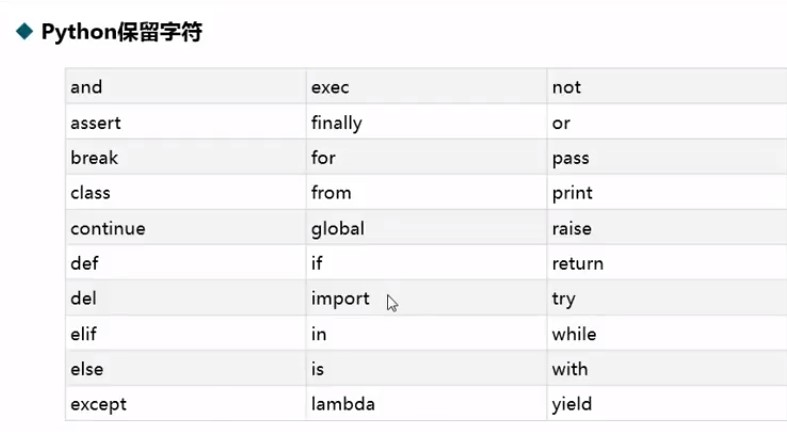
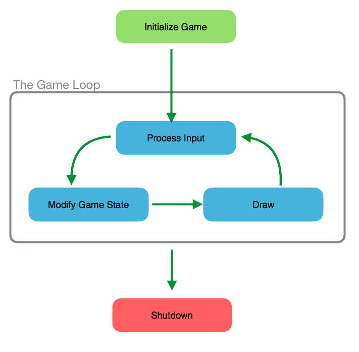
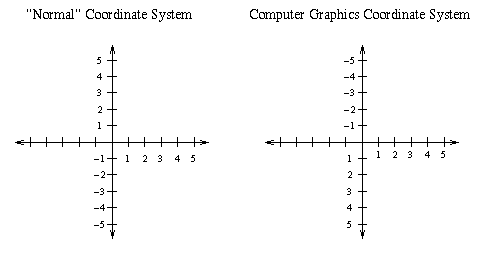

<style>
  :root{
      --color-background-code: #222222;
      --color-foreground: #FFF;
    }
  marp-pre,.language-python{
    border-radius: .5em;
    color:#FFF;
   padding: 1.2em!important;
  } 
  code{
    border-radius: 7px;
}
</style>

<!-- _backgroundImage: #000 -->

# Python基礎語法


---

# Python 簡介

* 直譯式程式語言
* 易於學習、閱讀和維護
* 廣泛應用於AI領域
* 網路爬蟲

---

# 變數

* 儲存資料
* 數字不可用於開頭字元。
* 可以使用英文字元、數字或下底線(_)命名。ex : number_id
* 英文大小寫是有差異的。
* 名稱不可使用python語言保留字詞。ex : int
* python會自己判斷資料型態
  
```python
x = "我是變數"
```

---

**輸出**

```python
print("Hello world")
```

**輸入**

```python
x = input("Hello world")
```

---

# 實作時間
### 題目:"輸出"一個叫做"x"的"變數"
### 輸出結果會是"Hello World"  
* 在Hello World前後要加上'' or ""

---

# 解答

```python
x = input("Hello World")
print(x)
```

---



---

# 資料型態
* 數值型態(Numeric type) - int, float, bool
* 字串型態(String type) - str
* 容器型態(Container type) - list, set, dict, tuple
* 用type()查看資料型態

---

# 數值型態

* int 
  * 整數
* float
  * 浮點數(有小數點)
* bool
  * ture
  * faulse

---

# 字串型態
* str(string)
* 字串
* 用''或""包住
* 可用+連接
* len()查看長度

---

# 容器型態之一:list

* 放多個資料的地方
* 由**中**括號組成並以逗號隔開不同資料(型態可不同)
* 索引值從0開始

```python
i_am_list = []# 宣告一個變數叫i_am_list
```

---

# 容器型態之二:tuple

* 放多個資料的地方
* 由**小**括號組成並以逗號隔開不同資料(型態可不同)
* 索引值從0開始
* 建立時就必須決定初執
* 建立後就只能讀取值，不能再修改

---

```python
>>> t = 12345, 54321, 'hello!'
>>> t[0]
12345
>>> t
(12345, 54321, 'hello!')
>>> # 可以是巢狀的:
... u = t, (1, 2, 3, 4, 5)
>>> u
((12345, 54321, 'hello!'), (1, 2, 3, 4, 5))
>>> # 不能更改:
... t[0] = 88888
Traceback (most recent call last):
  File "<stdin>", line 1, in <module>
TypeError: 'tuple' object does not support item assignment
>>> # 但是可以包含list:
... v = ([1, 2, 3], [3, 2, 1])
>>> v
([1, 2, 3], [3, 2, 1])
```

---

# 運算子
* `+`加
* `-`減
* `*`乘
* `/`除
* `%`取餘數
* `**`指數

---

## 關係運算子

<	小於
\>	大於	
<=	小於等於	
\>=	大於等於
==	相等	
!=	不相等	

---

# 練習時間

題目:鉛筆一支 5 元，一打 50 元。小明需要幫班上每位同學買一枝鉛筆，請問要多少錢？由於小明很注重環保，他絕不會為了省錢而多買任何不需要的東西。也就是說，小明買的鉛筆數量一定等於班上的人數。

---

# code

```python
a = int(input())
print(a // 12 * 50 + a % 12 * 5)
```

---

## 邏輯運算子
* `「and:且」`
全都正確才正確  
* `「or:或」` 
一個正確才正確
* `「not:非」`
對-->錯;錯-->對

---

## if

判斷條件 
* 對-->執行if中的程式  
* 錯-->跳出if往下執行，執行else

---

<!-- _backgroundImage: #000 -->

## else-if

* 用於多的條件時
* if執行時會跳過elif和else
* if是錯的-->判斷else-if，都錯-->執行else


---

```python
x = True
y = False
if y:               # False
  print("No way")
elif x and y:       # True and False
  print("come on!")
elif not x:         # not True
  print("please")
else                # do this
  print("嗨壓")
```

---

# 停車場盤子
輸入停車時間(minute)
停車一個小時40元,未滿一個小時收20元
停車費最高收300元
* 請輸出:要繳交?元

---

```python
time = int(input("請輸入停車分鐘數："))

hr = time//60 #取整數 (小時) 
mi = time % 60 #取餘數 (分鐘)

if mi>=1:  #如果分鐘 大於或等於1分鐘加收20
  pay=(hr*40+20)
else: #其他沒有分鐘就算小時收費
  pay=(hr*40)


if pay>300:
  pay=300
print(f"要繳交{pay}元")
```

---

# 迴圈

重複執行類似的事


---

# for 
可以透過Python迴圈來讀取串列中的每一個元素
較適用於「已知迴圈數」的問題
格式：

```python
for x in range(1, 10, 2):
   # 放要執行的東西
```

range(起始值,結束值,間距值)

---

# while

較適用於「無法預知迴圈數」的問題
格式：

```python
while 條件:   # 條件成立
    # 放要執行的東西
```

---

# break

強制跳出整個迴圈

```python
for i in range(1,5):
  if(i == 3):
    break
print(i) # 所以結果會列出3
```

---

## continue

強制跳出這過迴圈

```python
for i in range(1,5):
  if(i == 3):
    continue
print(i) # 會列出5
```

---

# 練習時間

* 輸入為一個整數 n
* 大於 0、整數、4和3的公倍數、小於 n，請輸出所有可能的數字。

---

# 函式

讓你的程式碼被重複的使用，並且提高維護性及可讀性

用法：

def 函式名稱(參數):
    函式主體

```python
def greet(name):
    """這個函式用於問候"""
    print(f"Hello, {name}!")

greet("Alice")  # Hello, Alice!
greet("Bob")    # Hello, Bob!
```

---

# pygame

---

# 安裝pygame

1. Window鍵
2. cmd
3. pip install pygame

---

# 基本架構



---

# 座標



---

# 事件(pygame.event)

* 退出
  * `pygame.QUIT`若使用者按下了右上角的叉叉
* 滑鼠
  * `pygame.MOUSEBUTTONDOWN`按下滑鼠按鍵
  * `pygame.MOUSEMOTION`移動滑鼠
  * `pygame.mouse.get_pos()`抓取滑鼠的位置
---
* 鍵盤
  * `pygame.KEYDOWN`按下鍵盤按鍵
  * `pygame.K_UP`上
  * `pygame.K_DOWN`下
  * `pygame.K_W`W鍵

---

# 圖形

* 

## [簡報1](https://hackmd.io/@andy010629/r103KC6Iv)
## [簡報2](https://hackmd.io/@Derek46518/HyZHsD0Qo)
